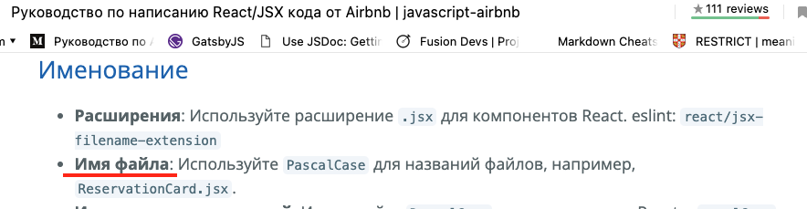

**Общее замечание**
Мой косяк. Но только заметил что ты называешь файлы с компонентами с маленькой буквы. Компоненты и файлы компонентов носят одно и то же названия и должны начинаться с заглавной. 



**src/core/helpers/assembleDateString.ts**

1. `assembleTimeString` в функции вынеси `new Date(date)` в переменную, чтобы обозначить ее один раз а не 3 раза делать одно и тоже. 
```
  if (relativeDate.includes('today')) return format(new Date(date), MESSAGE_TIME_FORMAT);

  очень длино и как то не по христьянски. Сделай как обыно и красиво
    if (relativeDate.includes('today')) { 
    return format(new Date(date), MESSAGE_TIME_FORMAT);
    }

```
 2. Тоже само про new `Date(date)` и в других функциях ниже.


____

**src/core/helpers/validation.ts**

1.   
```
export const validateInfoGroup = (value: string) => {
  if (!value.trim()) return false;
  return true;
};
```
замени на 
```
export const validateInfoGroup = (value: string) => !!value.trim()
```
____
**src/core/hooks/useChat.ts**

1. Зачем создаеешь соединение `socket` и потом дальше нигде не используешь `7` сторка ? 

2. `getUnreadMessagesCount` и `getUnreadChatMessagesCount` у `data` тип `any` ?
____
**src/core/hooks/useTabBar.ts**

1. 

```
const tabBarVisibility = useSelector((state: RootState) => state.app.tabBarVisibility);
```

у тебя же есть `useAppSelector` который уже типизирован. Используй его

2. Зачем у тебя функции `showTabBarFunc` и `hideTabBarFunc` асинхронные при этом у тебя не выполняеться ничего асинхронного. И еще ты используешь `try catch` только он ничего не отловит.

Если хочешь дожидаться и если у тебя `dispatch` асинхронный тогда пиши 
```
await dispatch(showTabBar());
```
в противном случае ожидаемый эффект ты не получишь

____

**src/core/utils/api/adapter.ts**
1. 
Зачем ?
```
axios.interceptors.request.use((config) => {
  return config;
})
```
____


**src/navigation/index.tsx**
Что то не понятно зачем тебе тут `isLoading` если ты не дожидаясь впринципе ничего сразу в `useEffect` сетишь `setLoading(false);` а потом уже подгруаешь юзера и его сообщения

```
 const [isLoading, setLoading] = useState<boolean>(true);
  const { user } = useAppSelector((store) => store.user);

  useEffect(() => {
    (async () => {
      const authToken = await Storage.authToken.get();

      if (authToken === token) return;

      setLoading(false);
      if (authToken) {
        dispatch(getUserThunk());
        dispatch(getUnreadMessagesCountThunk());
        socket.connect(authToken);
      }
      setToken(authToken);
    })();
  }, [user]);
```

____
**src/screens/addTextPost/components/accounts/account.tsx**

1. Изспользуй для таких вычисленией `useMemo`
```
const selected = index === 0 ? isPostForYou : !!groupsIds.find((item) => item === id);
```

2. Вынеси цвета в `constants`. Что то мне подсказывает что ты их используешь не только тут
```
 <Switch
    trackColor={{ false: "#707482", true: "#1c5b96" }}
    thumbColor={selected ? "#2C98F0" : "#FAFAFA"}
    ios_backgroundColor="#707482"
    onValueChange={() => selectAccount(id, index)}
    value={selected}
  />
```


**src/screens/addTextPost/components/accounts/hook.ts**

1. В таких случаях лучше обойтись без деструктуризации дабы избежять лишних ререндеров

```
const { ownGroups } = useAppSelector((store) => store.groups);
const { user } = useAppSelector((store) => store.user);
```

лучше будет так:

```
const ownGroups = useAppSelector((store) => store.groups.ownGroups);
const user  = useAppSelector((store) => store.user.user);
```

тогда мы можем быть точно уверенны что эти переменные будут изменны только в случае когда они реально поменяются. А в первом случае они менялись при любом изменении поля в `store.user` или `store.groups`


2. Заверни в `useMemo`

```
const myGroups = ownGroups?.map((group) => ({
    id: group.id,
    avatarUrl: group.avatarUrl,
    name: group.name,
  }));
  
  const accounts = myGroups?.length ? [{
    id: user.id,
    avatarUrl: user.avatarUrl,
    name: user.nickname,
  }, ...myGroups] : [{
    id: user?.id,
    avatarUrl: user.avatarUrl,
    name: user.nickname,
  },];


  Будет :


  const accounts = useMemo(() => {
    const myGroups = ownGroups?.map((group) => ({
    id: group.id,
    avatarUrl: group.avatarUrl,
    name: group.name,
  })) ?? [];

  return accounts = [{
    id: user.id,
    avatarUrl: user.avatarUrl,
    name: user.nickname,
  }, ...myGroups];

  }, [ownGroups, user])

```

3. А тут хоршо подойдет `useCallback`

```
const selectAccount = (id: number, index: number) => {
    if (index === 0) {
      dispatch(setIsPostForYou());
    } else {
      dispatch(changeGroupIds(id));
    }

  };
```

____
**src/screens/addTextPost/components/accounts/index.tsx**

1. У `renderItem` для `flatList` есть специальный тип:

```
const renderItem: ListRenderItem<IAccount> = ...
```

**src/screens/addTextPost/components/previewPhoto/hook.ts**
1. Если у тебя функции не зависят от внешних переменных а опираются только на аргументы функции старайся упаковывать их в `useCallback`:

```
const handleChangeText = (value: string) => {
    dispatch(setPostDescription(value));
  };
```

И далее по коду везде =).

____

**src/screens/addTextPost/index.tsx**

вынеси в переменную 
```
!!(groupsIds.length || isPostForYou) && !!description && 
```

____

**src/screens/auth/components/selectList/index.tsx**
Перенос строк
```
<SearchInput type="small" value={search} onChangeText={handleChangeSearch} placeholder="Search country..." />
```

____

**src/screens/auth/hook.ts**

Это условие не выполнится для `0` . Так как `0 == false в if`  таким образом у тебя получается  `if (false && 0 >= 0 && 'someDigitalcode') `
```
 if (idx && idx >= 0 && dialCode)
```

____
**src/screens/auth/index.tsx**
порешай в этом файле перенос строк


____
**src/screens/chat/components/channels/hook.ts**
1. убери деструктуризацию 
```
const { channels } = useAppSelector((store) => store.chats);
```

2. `handlePressChannel` заверни в `useCallback`

____

**src/screens/chat/components/channels/index.tsx**

1. Цвета вынеси в константы

```
 <LinearGradient colors={['#0E354C', '#191F35']} style={styles.container}>
```

____
**src/screens/chat/components/editingMessage/hook.ts**
1. убери деструктуризацию 
```
const { editingMessage } = useAppSelector((store) => store.chats);
```

2. `hideEditField` заверни в `useCallback`

____
**src/screens/chat/components/header/hook.ts**
1. убери деструктуризацию 
```
const { chatId } = useAppSelector((store) => store.chats);
```

____
**src/screens/chat/components/header/index.tsx**
Разберись тут с переносом строк

____

**src/screens/chat/components/messages/hook.ts**
1. убери деструктуризацию 
```
const { messages } = useAppSelector((store) => store.chats);
```

2. `getMessages` заверни в `useCallback`

____
**src/screens/chat/components/messages/index.tsx**
1. Добавь типизацию для `renderItem`
2. Цвета отправить в константы
```
<LinearGradient
    pointerEvents="none"
    colors={['#00D9FF', '#18223D10']}
    style={styles.overlay}
  />
```

____
**src/screens/chat/components/noAvatar/hook.ts**

Заверни вычисление в `useMemo`
```
const chat = chats.find((item) => item.id === chatId);
const isGroupChat = chat ? !!chat.groupId : false;
```

____

**src/screens/chat/components/noAvatar/index.tsx**
Цвета вынеси в константы

```
colors={['#0084FE', '#4FD4FE']} 
```


____
**src/screens/chat/hook.ts**

1. Убери деструктуризацию 
```
 const { modalVisibility } = useAppSelector((store) => store.app);
```
2. Много что можно упаковать в `useCallback`


____
**src/screens/chatList/components/chatItem/hook.ts**
1. Почему `any` ?
```
swipeable: any;
```

2. Убери деструктуризацию 
```
const { chatId } = useAppSelector((store) => store.chats);
const { user } = useAppSelector((store) => store.user);
```

____
**src/screens/chatList/hook.ts**

1. Убери деструктуризацию 
```
 const { modalVisibility } = useAppSelector((store) => store.app);
```
2. Много что можно упаковать в `useCallback`

____
**src/screens/chatList/index.tsx**

1. Типизация для `renderItem`
